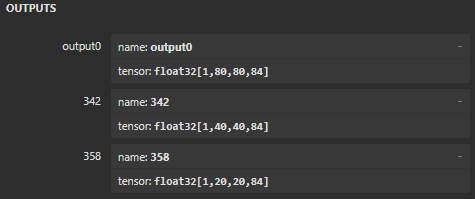

# Testing and validating YOLO models
This project enables the validation and testing of YOLO models, after acceleration on the KHADAS VIM3, by utilizing its NPU, as well as after quantization. This allows us to obtain not only the inference time of these models, but also their accuracy.

# Full pipeline from YOLO pt model to running it on Khadas VIM3

An important notice is that this file worked under the ultralytics's version 8.3.117.

## Step 1 - Training YOLO model on custom dataset
While Ultralytics offers many YOLO model versions as well as sizes, they all come pre-trained on the COCO dataset. However, we want the model to be able to detect whatever we want it to detect. For that, we train the YOLO model on our own custom dataset, as can be seen in the following Python snippet.

```python
from ultralytics import YOLO

model = YOLO('yolov8n.pt') # yolov8n as an example

model.train(data='dataset_path.yaml', epochs=10, batch=16)
```
It should go without saying that we need to pip install ultralytics first. Additionally, should you need any more training options, like changing the name of the directory the results will be stored in, or changing the image size the model uses, etc, you can see all the options on the [ultralytics training docs](https://docs.ultralytics.com/modes/train/#train-settings "Ultralytics training docs").

One key detail to keep in mind as well is that your custom dataset's YAML file needs to be structured the same way yolo's is, which is presented [here](https://docs.ultralytics.com/yolov5/tutorials/train_custom_data/#11-create-datasetyaml "YOLO yaml structure").

After training, you may also check your model's performance using the validation or test split, if your dataset has them.

```python
metrics = model.val(data='datase_path.yaml')

print("Evaluation Results:", metrics)
```

## Step 2 - Exporting the YOLO model in ONNX format
After training and validating the model's performance, we need to export the model in the right format for the khadas conversion tool to be able to convert the model to the npu binaries. While the conversion tool works with several formats, in this example, we will use Open Neural Network Exchange, or ONNX.

Usually, this export is straightforward and simple, however, in order to effectivelly use the Khadas's npu, the head of the model needs to be changed to fit with in the khadas's conversion tool specifications. To do this, we need to change the head of the model by updating the code in the Ultralytics package (as khadas specifies [here](https://docs.khadas.com/products/sbc/vim3/npu/vim3_demo_lite/yolov8n "Khadas yolov8n example")).

To contain this change, so as not to harm the original Ultralytics package, we can create a Python environment that contains the changed Ultralytics package. For that, we run the following console commands.

It is also worth mentioning that the conversion failed to work with PyTorch versions newer than 1.9.1. As this torch version is only available up to Python 3.9, it is recommended to create the Python environment using Python 3.9, as follows.

```cmd
python3.9 -m venv python_env

python_env\Scripts\activate

cd python_env

pip install ultralytics==8.3.117 torch==1.9.1 torchvision==0.10.1 torchaudio==0.9.1

pip install "numpy<2"
```

After setting up the environment, we update the file `python_env\Lib\site-packages\ultralytics\nn\modules\head.py`, where we swap the forward definition, in line 114, shown below.

```python
def forward(self, x: List[torch.Tensor]) -> Union[List[torch.Tensor], Tuple]:
    """Concatenate and return predicted bounding boxes and class probabilities."""
    if self.end2end:
        return self.forward_end2end(x)

    for i in range(self.nl):
        x[i] = torch.cat((self.cv2[i](x[i]), self.cv3[i](x[i])), 1)
    if self.training:  # Training path
        return x
    y = self._inference(x)
    return y if self.export else (y, x)    
```

For the following script.

```python
def forward(self, x: List[torch.Tensor]) -> Union[List[torch.Tensor], Tuple]:
    if torch.onnx.is_in_onnx_export():
        return self.forward_export(x)

    """Concatenate and return predicted bounding boxes and class probabilities."""
    if self.end2end:
        return self.forward_end2end(x)

    for i in range(self.nl):
        x[i] = torch.cat((self.cv2[i](x[i]), self.cv3[i](x[i])), 1)
    if self.training:  # Training path
        return x
    y = self._inference(x)
    return y if self.export else (y, x)

def forward_export(self, x):
    results = []
    for i in range(self.nl):
        dfl = self.cv2[i](x[i]).contiguous()
        cls = self.cv3[i](x[i]).contiguous()
        results.append(torch.cat([cls, dfl], 1).permute(0, 2, 3, 1))
    return tuple(results)
```

After updating `head.py`, we can simply run the following code to export the model as ONNX.

```python
from ultralytics import YOLO

model = YOLO('your_yolo_model.pt')

model.export(format='onnx')
```

To check if the export was correctly done, we use [netron.app](https://netron.app "netron.app") to view our model's architecture, and we can check if the model´s output matches the expected one, presented below.



It is possible for the model's output to be different. In the case of the first output above, [1, 80, 80, 84], 1 refers to the batch size, in other words, one image. 

Both numbers after 80, 80, or any other, are directly dependent on the image resolution the model was trained with, as well as the stride parameter, which is an internal YOLO parameter that determines how much the network downsamples an image. So, for a model trained on 640 by 640 pixels, the first output should be your model's resolution, i.e., 640 divided by a stride value of 8, which is 80. The second output, the stride value is 16, which means an output value of 640 divided by 16, equalling 40. And the third and final output, the stride value is 32, resulting in an output value of 20. The stride parameter is always the same. What can change, however, is the resolution the model was trained on. For a model trained on 480 by 480 pixels, the correct values should be: 

- output0 -> 60; 

- output1(342 in the image above) -> 30; 

- output2(358 in the image above) -> 15.

Finally, the last value, 84, is calculated using the following code, in line 42, in file `python_env\Lib\site-packages\ultralytics\nn\modules`.

```python
self.reg_max = 16  # DFL channels (ch[0] // 16 to scale 4/8/12/16/20 for n/s/m/l/x)
self.no = nc + self.reg_max * 4  # number of outputs per anchor
```

In this code, the parameter `nc` refers to the number of classes the model was trained on. So for a dataset with 20 classes, this value will be 20 + 16 * 4, or 84. 

## Step 3 - Converting the ONNX model using Khadas's conversion tool
Having exported the model as ONNX, the model is ready to be converted using Khadas's conversion tool to be run on the VIM3 board. For this step, we can follow Khadas's own [guide](https://docs.khadas.com/products/sbc/vim3/npu/vim3_demo_lite/yolov8n "Khadas's conversion guide") to convert the model.

Firstly, we need to use a linux x86 environment, like ubuntu on wsl. Then we clone the conversion tool from Khadas' GitHub repository.

```bash
$ git clone --recursive https://github.com/khadas/aml_npu_sdk
```
After cloning, we can move to the `aml_npu_sdk/acuity-toolkit/demo/model` directory, and place our ONNX export model here. Then, we also need to modify three files in the `aml_npu_sdk/acuity-toolkit/demo` directory. The first we need to modify is `0_import_model.sh`, where we change the code to the following.

```bash
#!/bin/bash
 
NAME=yolo_model
ACUITY_PATH=../bin/
 
pegasus=${ACUITY_PATH}pegasus
if [ ! -e "$pegasus" ]; then
    pegasus=${ACUITY_PATH}pegasus.py
fi
 
#Onnx
$pegasus import onnx \
    --model  ./model/${NAME}.onnx \
    --output-model ${NAME}.json \
    --output-data ${NAME}.data 
 
#generate inpumeta  --source-file dataset.txt
$pegasus generate inputmeta \
	--model ${NAME}.json \
	--input-meta-output ${NAME}_inputmeta.yml \
	--channel-mean-value "0 0 0 0.0039215"  \
	--source-file dataset.txt
```

Is it worth noting that the `NAME` parameter needs to be the same as your ONNX file name, so if the ONNX file is named `yolo_model.onnx`, then the `NAME` parameter should be `yolo_model_`. Additionally, the `dataset.txt` file should contain the path to a file with around 300 images from the test split, or real application images, so that the tool can calibrate internal values.

An example of the `dataset.txt` file is presented below.

```notepad
./data/20003894.jpg
./data/20010518.jpg
./data/20007148.jpg
./data/20004429.jpg
./data/20006090.jpg
./data/20011907.jpg
./data/20005049.jpg
./data/20000903.jpg
./data/20004007.jpg
./data/20008013.jpg
./data/20008452.jpg
```

The `data` folder sits inside the `aml_npu_sdk/acuity-toolkit/demo` directory, and it must contain the images with the same names they have in the `dataset.txt` file.

Then we modify the `1_quantize_model.sh` file as follows.

```bash
#!/bin/bash
 
NAME=yolo_model
ACUITY_PATH=../bin/
 
pegasus=${ACUITY_PATH}pegasus
if [ ! -e "$pegasus" ]; then
    pegasus=${ACUITY_PATH}pegasus.py
fi
 
#--quantizer asymmetric_affine --qtype  uint8
#--quantizer dynamic_fixed_point  --qtype int8(int16,note s905d3 not support int16 quantize) 
# --quantizer perchannel_symmetric_affine --qtype int8(int16, note only T3(0xBE) can support perchannel quantize)
$pegasus  quantize \
	--quantizer dynamic_fixed_point \
	--qtype int8 \
	--rebuild \
	--with-input-meta  ${NAME}_inputmeta.yml \
	--model  ${NAME}.json \
	--model-data  ${NAME}.data \
    --batch-size 1 \
    --iterations 300
```
It is in this file where we can choose the quantization type we want to use by changing the `--qtype` and `--quantizer` paramaters, as is shown in the commented lines. The `--batch-size` and `--iterations` parameters are dependent on the number of images the `dataset.txt` file contains. Instead of these value, `--batch-size` could be 3 and `--iterations` 100, for example.

And thirdly, we modify the `2_export_case_code.sh` file.

```bash
#!/bin/bash
 
NAME=yolo_model_
ACUITY_PATH=../bin/
 
pegasus=$ACUITY_PATH/pegasus
if [ ! -e "$pegasus" ]; then
    pegasus=$ACUITY_PATH/pegasus.py
fi
 
$pegasus export ovxlib\
    --model ${NAME}.json \
    --model-data ${NAME}.data \
    --model-quantize ${NAME}.quantize \
    --with-input-meta ${NAME}_inputmeta.yml \
    --dtype quantized \
    --optimize VIPNANOQI_PID0X88  \
    --viv-sdk ${ACUITY_PATH}vcmdtools \
    --pack-nbg-unify
 
rm -rf ${NAME}_nbg_unify
 
mv ../*_nbg_unify ${NAME}_nbg_unify
 
cd ${NAME}_nbg_unify
 
mv network_binary.nb ${NAME}.nb
 
cd ..
 
#save normal case demo export.data 
mkdir -p ${NAME}_normal_case_demo
mv  *.h *.c .project .cproject *.vcxproj BUILD *.linux *.export.data ${NAME}_normal_case_demo
 
# delete normal_case demo source
#rm  *.h *.c .project .cproject *.vcxproj  BUILD *.linux *.export.data
 
rm *.data *.quantize *.json *_inputmeta.yml
```
After modifying the three files and adding the ONNX file, we can return to the `aml_npu_sdk` directory and run the `convert-in-docker.sh` script to begin the conversion. If successful, the converted model and library will be available in the `aml_npu_sdk/acuity-toolkit/demo/yolov8n_nbg_unify` directory.

The three important files that we will later need to send to the Khadas board are `vnn_yolomodel.c`, `vnn_yolomodel.h`, and `yolo_model.nb`.

## Step 4 - Running the model on Khadas
The next step is to run inference on the Khadas board using the converted model and analyzing the results. For this, we first clone the official Khadas respository available [here](https://github.com/khadas/vim3_npu_applications_lite/tree/master/yolov8n_demo_x11_usb "Khadas Official Demo Repo").

After cloning the repo, copy and replace all files from `YOLO_validation` into the cloned repo. Additionally, inside the cloned `include` folder, change the `MAX_DETECT_NUM`, inside the `nn_detect_utils.h` file, to a higher value, so that the model is able to detect more objects in one image. Furthermore, inside the `YOLO_validation/include/model_pre_post_processing.h` and `YOLO_validation/model_pre_post_processing.c` files, it is possible to change the number of classes your dataset has, as well as the class labels themselves, respectivelly. Change these values to match your own dataset's values.

This will allow you to run inference on the whole test split of your dataset, returning the average inference speed per image, aswell as pre-processing and post-processing speeds per image, and the average FPS your model achieves. Additionally, it stores all detection results and bounding boxes, so that we can later run against the dataset's ground-truth bounding boxes to achieve the model's precision.

After cloning, copying and replacing all files, we replace the existing `vnn_yolomodel.c` in the `YOLO_validation` directory, the `vnn_yolomodel.h` in the `YOLO_validation/include`, and the `yolo_model.nb` in the `YOLO_validation/bin/nb_model` with the corresponding files generated previously by the conversion tool.

You will also need to create the `output_images` directory here to store the results. Then, inside `YOLO_validation\main.cpp`, change the `output_dir` to whatever file name you want, for example, `output_dir\yolo_v8n`, to better store the results of your models.

To run inference, we go into the `YOLO_validation` directory and run the following line.

```bash
bash build_vx.sh
```

And finally, we move to the `YOLO_validation/bin` directory and run the last command.

```bash
./run_validation
```

The output_dir paramater will determine where the results wil be stored inside the `YOLO_validation/bin/output_images`. 

## Step 5 - Checking the model's precision
Finally, the last step is to check the model's precision. To do this, we copy Khadas's inference results, the ones we store in `YOLO_validation/bin/output_images`, to our PC. Here we can use the YOLO_metrics folder's contents.

This code is an adaptation of the [Cartucho's mAP repo](https://github.com/Cartucho/mAP "Cartucho's mAP repo"), where we added the ability to also check the mAP@50-95, as well as adding the ability to store multiple tests, without the need to either overwrite the last test or having to copy results around.

To use it, you first need to copy Khadas's results to the `YOLO_metrics\input\detection-results`, and you can create another file inside here, for example `yolov8n`, to keep the results of this model indefinitely. Then, to run the code, we move to the `YOLO_metrics` directory, and run the following command.

```cmd
py map5095.py --dr "yolov8n"
```
Here, the `--dr` parameter represents the results obtained in Khadas, stored in the `YOLO_metrics\input\detection-results` directory. The results of this code will then be available in `mAP\output\yolov8n`, under the same name as the input folder. Additionally, the mAP@50-95 value will be printed on the terminal.

# Acknowledgment

This project includes adapted code from the repository:
[Cartucho/mAP](https://github.com/Cartucho/mAP), licensed under the Apache License 2.0.

Modifications made:
- Added support for mAP@50–95 calculation.
- Added functionality to store and manage multiple test results without overwriting.
- Adapted paths and integration with Khadas YOLO output directories.

Original license text is available in `YOLO_metrics/LICENSE` and at:
http://www.apache.org/licenses/LICENSE-2.0
